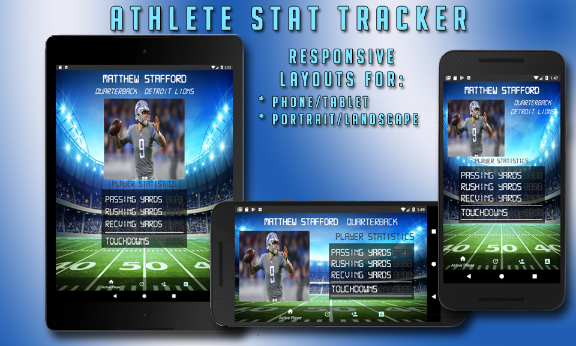
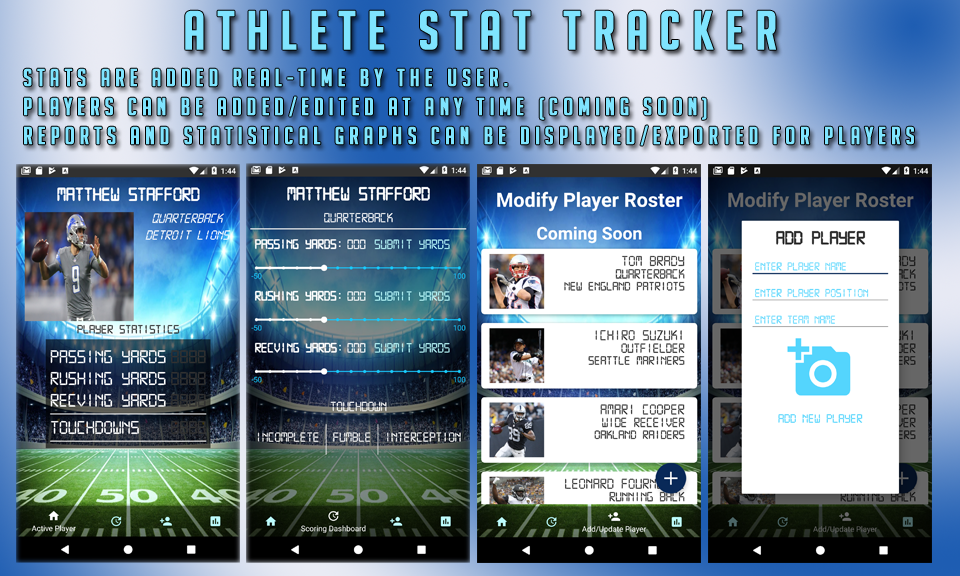

# Favorite Athlete Stat Tracker

This application is intended for parents of student athletes who want to track their student's progress across seasons and multiple sports.

Currently the app supports football only, but my goal is to implement other stat-trackable sports as I further develop this app.

This app has custom layouts to account for orientation and screensizes across multiple devices.

## App Capabilities

Passing, Rushing & Receiving yards can be submitted uniquely per player, and will update on the player home page as they are submitted. The same concept applies for touchdowns, fumbles & interceptions.

Players can be added/modified/removed from the database at the user's discretion. (Currently in development -- not deployed in project files)

This app utilizes 2 external libraries, as well as incorporating the RecyclerView and PagerView Adapters.

### Library Implementations
Material Bottom Navigation: https://github.com/sephiroth74/Material-BottomNavigation
Bubble Seekbar: https://github.com/woxingxiao/BubbleSeekBar
